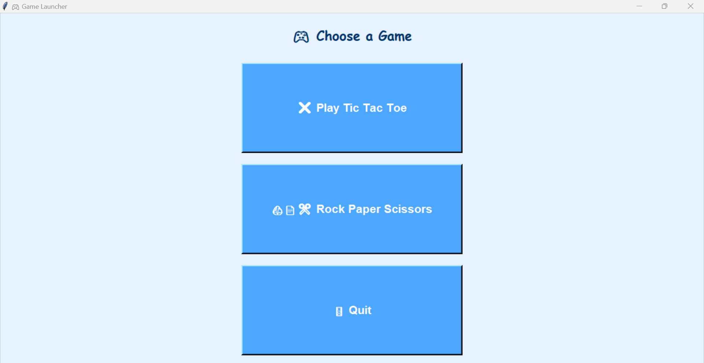
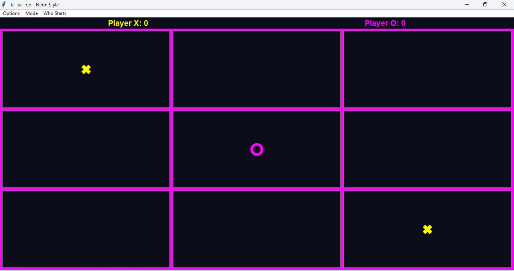
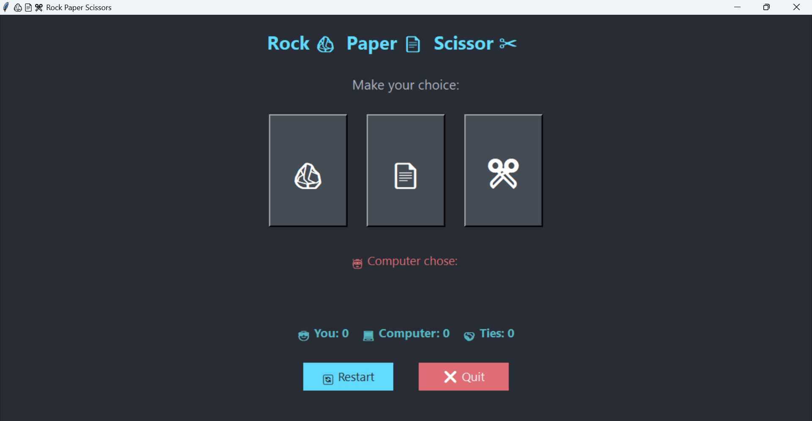

# 🎮 Game Launcher: Tic Tac Toe & Rock Paper Scissors

A simple Python desktop application with a game launcher GUI that lets you play **Tic Tac Toe** (with Neon style and AI opponent) and **Rock Paper Scissors** (vs computer) using Tkinter.

---

# 🏗️ Tech Stack

- **Language**: Python 3
- **GUI Framework**: Tkinter (built-in)

## 🖥️ Features

### ✅ Tic Tac Toe
- Neon-themed UI with vibrant colors.
- Two game modes:
  - Two Player (Local multiplayer)
  - Play vs Computer (AI uses Minimax algorithm for unbeatable gameplay)
- Score tracking for Player X and Player O.
- Option to select who starts first (Human or Computer).
- Visual highlights of winning combinations.
- Responsive grid buttons.

### ✅ Rock Paper Scissors
- Modern dark-themed interface.
- Large emoji-based buttons for Rock 🪨, Paper 📄, and Scissors ✂️.
- Real-time score tracking: Player wins, Computer wins, and ties.
- Computer randomly selects a move.
- Restart and Quit buttons.
- Hover effects on buttons for better UX.

### ✅ Game Launcher
- Simple launcher GUI to select either game or quit.
- Clean and colorful interface.
- Easy to extend for additional games.

---

## Installation

1. Make sure you have Python 3 installed.
2. Clone or download this repository.
3. No external dependencies are required besides Python’s built-in `tkinter` module.

---

## ▶️ How to Run

- Run the launcher script to start:

  ```bash
  python game_launcher.py

# 🧠 Game Logic
-In Tic Tac Toe, use the menu to switch modes and reset the game.
-In Rock Paper Scissors, select your move by clicking the emoji buttons.
-Both games track scores during the session.
-Close each game window or use Quit to exit.

## 📸 Screenshot







# 📜 License
- This project is for educational and personal use.
